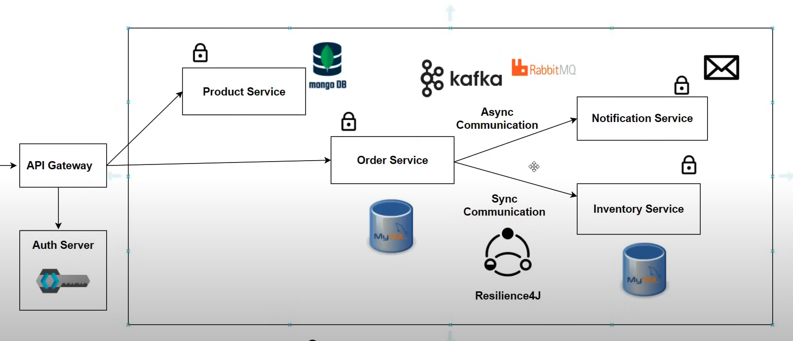

# Sample E-commerce Site with Spring Boot Microservices

This project is a sample e-commerce application built using a microservices architecture with Spring Boot. It demonstrates various core components of a modern microservices-based application, including service discovery, API gateway, distributed tracing, security, and more.

## Project Overview

The application consists of multiple microservices, each responsible for a distinct aspect of the e-commerce platform. Key features include service discovery, secure communication, resilient architecture, event-driven communication, containerization, and monitoring, making it a robust example for learning and understanding microservices architecture.

## Features

- **Microservices with Spring Boot**: The application is built as a collection of Spring Boot-based microservices, each dedicated to a specific business capability, such as product management, order processing, and user management.
- **Databases**:
  - **NoSQL (MongoDB)** for scalable storage of product and catalog data.
  - **SQL (MySQL)** for transactional data like orders and user information.
- **Service Discovery with Netflix Eureka**: Dynamic discovery of microservices, enabling flexibility and scalability within the architecture.
- **API Gateway with Spring Cloud Gateway**: Serves as a single entry point for client requests, handling request routing, load balancing, and security.
- **Secured Microservices with Keycloak**: Uses Keycloak for centralized authentication and authorization, securing access to each microservice.
- **Circuit Breaker**: Implements circuit breaker patterns to gracefully handle failures in inter-service communication and improve fault tolerance.
- **Distributed Tracing**: Traces requests across multiple microservices to provide detailed insights into service interactions and identify bottlenecks.
- **Event-Driven Architecture with Kafka**: Uses Apache Kafka for asynchronous communication between microservices, promoting loose coupling and eventual consistency.
- **Dockerized Application**: The application is containerized using Docker, allowing for easy deployment and scalability.
- **Monitoring with Prometheus and Grafana**: Provides real-time monitoring and visualization of microservices, including performance metrics and health status.

## Microservices

The project is structured as a set of independent microservices, each with its own database, API, and business logic. Here’s a brief overview of the primary services:

1. **Product Service**: Manages product catalog, including product details, categories, and inventory.
2. **Order Service**: Handles order placement, processing, and order history.
3. **User Service**: Manages user profiles, registration, and authentication.
4. **Cart Service**: Manages user shopping carts.
5. **Payment Service**: Handles payment processing and order finalization.

## Architecture Overview

The architecture leverages multiple Spring Cloud components for a resilient and scalable microservices setup. Here are some key architectural components:

- **Eureka Server**: Service registry for discovering available microservices.
- **Spring Cloud Gateway**: Central gateway for all client requests, providing load balancing and routing.
- **Keycloak**: Manages authentication and authorization for secure access to microservices.
- **Circuit Breaker**: Uses Spring Cloud Circuit Breaker for handling partial service failures.
- **Kafka**: Acts as the message broker for asynchronous communication between microservices.
- **Prometheus and Grafana**: Provides monitoring and visualization of application metrics.




## Prerequisites

To run this project, you’ll need the following:

- **Java 11 or higher**
- **Maven** for building the project
- **Docker** and **Docker Compose** for containerized deployment
- **MongoDB** and **MySQL** databases
- **Kafka** for event-driven communication
- **Keycloak** for security and authentication

## Setup and Installation

1. **Clone the Repository**:
   ```bash
   git clone https://github.com/your-username/sample-ecommerce-springboot-microservices.git
   cd sample-ecommerce-springboot-microservices

2. **Configure Databases**:
	•	Set up MongoDB and MySQL with the necessary configurations in each microservice’s application.yml.

3. **Run Keycloak**:
	•	Install and configure Keycloak for handling authentication.
	•	Import the realm configuration file if provided.

4. **Start Services with Docker Compose**:
	•	A docker-compose.yml file is provided to start the application with all services.

   ```bash
   docker-compose up

5. **Access the Eureka Dashboard**:
   •	Eureka service discovery dashboard is available at http://localhost:8761.

6. **Access the API Gateway**:
	•	The API Gateway can be accessed at http://localhost:8080.


## Running the Microservices

To run the individual microservices locally, navigate to each service directory and use the following command:
mvn spring-boot:run

## Monitoring and Observability

### Prometheus and Grafana

- **Prometheus** collects metrics from each microservice, accessible at [http://localhost:9090](http://localhost:9090).
- **Grafana** provides visualizations for these metrics, accessible at [http://localhost:3000](http://localhost:3000). You can set up dashboards in Grafana to monitor various aspects of the microservices.

### Distributed Tracing

Distributed tracing is enabled to trace requests as they pass through multiple microservices, helping you analyze and debug request flows.

## Key Libraries and Dependencies

- **Spring Boot**: Core framework for creating standalone Spring applications.
- **Spring Cloud**: Provides tools for building distributed systems, including service discovery, circuit breakers, and API gateways.
- **Spring Data JPA & MongoDB**: Simplifies data access with SQL (MySQL) and NoSQL (MongoDB).
- **Kafka**: Enables event-driven communication between services.
- **Keycloak**: Provides centralized authentication and authorization.
- **Prometheus and Grafana**: Allows monitoring and visualization of metrics.

## Project Structure

Each microservice is contained within its own module, structured as follows:

```plaintext
├── product-service
├── order-service
├── user-service
├── cart-service
├── payment-service
└── eureka-server
